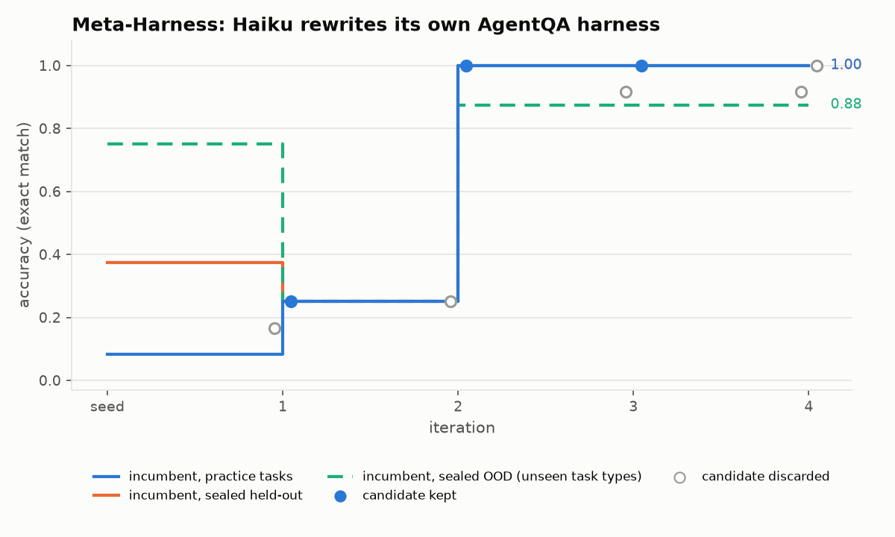

# RSI: a toolkit for recursive self-improvement loops

`rsi` reproduces the mechanisms of seven 2026 self-improvement techniques on one shared,
tested core, so they can be applied to new problems:

| Method | Improves | Keep rule | Package |
|---|---|---|---|
| **autoresearch** (Karpathy) | the work: one editable script under a fixed budget | strictly better on one number | `rsi.autoresearch` |
| **RRSI** (Google, arXiv 2609.24972) | the agent harness | noise floor + leakage critic + cost rule + pruning | `rsi.rrsi` |
| **Dream-RSI** (DeepMind, arXiv 2609.14858) | the search strategy, as code | best replay score over past searches | `rsi.dream` |
| **EvoMap** (+ "Behind EvoMap") | a shared library of strategy genes | local validation + hub ranking (naive vs safe) | `rsi.evomap` |
| **GEPA** (ICLR 2026) | prompts inside a compound system | minibatch improvement, Pareto frontier, merge | `rsi.gepa` |
| **Meta-Harness** (Stanford) | harness code, end to end | none: all candidates evaluated; Pareto frontier | `rsi.metaharness` |
| **SoL-Pi** (NVIDIA) | token-saving harness mechanisms | dual gate across environment families | `rsi.solpi` |

All of them run the same loop: propose a change, run it, score it with a grader the loop
cannot touch, then keep or discard. New to the topic? Start with **[docs/guide/RSI-101.md](docs/guide/RSI-101.md)**.

## Install

```bash
pip install -e ".[science,dev]"      # numpy, scipy, scikit-learn, matplotlib, pytest
```

Model backends (`rsi.core.get_llm`):
- `mock` / simulated models: offline and deterministic, used by the tests.
- `claude:<model>`: the headless `claude -p` CLI.
- `api:<model>`: the Anthropic API; needs `ANTHROPIC_API_KEY`.

## Quick start

```bash
python -m rsi.cli methods                                    # what each technique does
python -m rsi.cli improve --method rrsi --problem agentqa --llm sim --out runs/rrsi-sim     # offline, seconds
python -m rsi.cli improve --method rrsi --problem agentqa --llm claude:haiku --out runs/rrsi-live --set T=6
python -m rsi.cli inspect runs/rrsi-live                     # per-iteration audit trail -> TRACE.md
python -m rsi.cli experiments                                # every reproduction experiment
python -m rsi.cli experiment rrsi e0_overfitting_trap        # run one
```

```python
import rsi
from rsi.domains.agentqa import AgentQADomain

dom = AgentQADomain()                                          # practice: number problems; unseen: dates, number theory, text, lists
res = rsi.improve(dom, method="rrsi", llm_task="claude:haiku", llm_propose="claude:haiku",
                  config={"T": 6}, out_dir="runs/rrsi")
print(rsi.transfer_report(dom, rsi.get_llm("claude:haiku"), {"seed": res.baseline, "rrsi": res.best}))
```

## Apply it to your own problem

1. Write a `Domain`. Implement `execute(artifact, task, seed, llm)` to run your artifact, and
   `grade(task, execution)` to score it with your locked grader. Or wrap two plain functions
   with `FunctionDomain`.
2. Build a `TaskSuite` with an `evolve` split, plus `holdout`/`ood` splits the loop never sees.
3. Measure noise on the seed (`Evaluator` + `noise_from_trials`).
4. Pick a method (`rsi.recommend(...)`), run `rsi.improve(...)`, then read the
   `transfer_report` and the trace.

The Claude Code skill in `.claude/skills/rsi-improve/SKILL.md` walks through these steps. Each
method also ships `experiments/<method>/example_new_problem.py` as a template.

## See it working

[`demo/`](demo/README.md) has fresh live runs with Claude Haiku: Meta-Harness, RRSI and autoresearch improving a real LLM agent harness and a training script. Each has per-iteration graphs, every candidate the model proposed, the gate's verdict, sealed held-out and OOD scores, and the code it produced.



## Repository map

Every method uses one slug everywhere: `autoresearch`, `rrsi`, `dream-rsi`, `evomap`, `gepa`, `metaharness-solpi`.
Its docs hub is `docs/methods/<slug>/README.md`.

| Method | Docs hub | Code | Tests | Experiments | Results | Validation |
|---|---|---|---|---|---|---|
| Autoresearch | [docs](docs/methods/autoresearch/README.md) | [`rsi/autoresearch`](rsi/autoresearch) | [tests](tests/autoresearch) | [scripts](experiments/autoresearch) | [results](results/autoresearch) | [runs](validation/autoresearch) |
| RRSI | [docs](docs/methods/rrsi/README.md) | [`rsi/rrsi`](rsi/rrsi) | [tests](tests/rrsi) | [scripts](experiments/rrsi) | [results](results/rrsi) | [runs](validation/rrsi) |
| Dream-RSI | [docs](docs/methods/dream-rsi/README.md) | [`rsi/dream`](rsi/dream) | [tests](tests/dream-rsi) | [scripts](experiments/dream-rsi) | [results](results/dream-rsi) | [runs](validation/dream-rsi) |
| EvoMap | [docs](docs/methods/evomap/README.md) | [`rsi/evomap`](rsi/evomap) | [tests](tests/evomap) | [scripts](experiments/evomap) | [results](results/evomap) | [runs](validation/evomap) |
| GEPA | [docs](docs/methods/gepa/README.md) | [`rsi/gepa`](rsi/gepa) | [tests](tests/gepa) | [scripts](experiments/gepa) | [results](results/gepa) | [runs](validation/gepa) |
| Meta-Harness, SoL-Pi | [docs](docs/methods/metaharness-solpi/README.md) | [`rsi/metaharness`](rsi/metaharness), [`rsi/solpi`](rsi/solpi) | [tests](tests/metaharness-solpi) | [scripts](experiments/metaharness-solpi) | [results](results/metaharness-solpi) | [runs](validation/metaharness-solpi) |

```
rsi/            the Python package
  core/         shared machinery: LLM backends, Artifact, TaskSuite (sealed splits), Domain, Evaluator,
                stats (noise band, CIs), gates (keep rules), Ledger, editors, leakage critic, sandbox
  <method>/     one package per technique
  domains/      agentqa (shared harness domain) + method-specific domains with ground truth
  api.py        rsi.improve(), rsi.recommend()        cli.py   command line
  trace.py      per-iteration trace, shadow held-out monitor, run inspector
docs/           README index; guide/ (RSI-101, architecture); methods/<slug>/ (hub, paper spec,
                implementation, claims audit); core/; reports/ (claims summary, HTML report)
tests/          core/ and one folder per method; offline and deterministic (pytest -m live for live checks)
experiments/    reproduction scripts per method; they write results/<slug>/*.json and figures
validation/     fresh traced runs from the seed per method, with AUDIT.md and RUNS.md
```

## What is verified

- **Paper specs** (`docs/methods/<slug>/paper-spec.md`): built from the papers and the authors' released code.
  Every detail is tagged with its source.
- **Implementation notes** (`implementation.md`): module map, API, and each claim mapped to code, experiment and result.
- **Claims audits** (`claims-audit*.md`, summary in [docs/reports/claims-summary.md](docs/reports/claims-summary.md)):
  475 paper claims, each checked against our code and evidence. After a fix round and a second, preregistered and
  adversarially reviewed attempt at every claim that still failed, 257 reproduce, 79 partially, 7 do not,
  123 need frontier models, GPUs or the original benchmarks, and 9 are contradicted (most of these by the
  paper's own data or reference code).
- **Step-by-step validation** ([validation/README.md](validation/README.md)): each method was run from its untouched
  seed, offline and with live Claude Haiku, with every iteration traced. Independent auditors re-derived each step
  from the raw trial scores and checked it against the paper: 2,195 of 2,370 steps verified correct, and no gate
  decision was miscomputed.
- **Experiments** use multiple seeds and report means with 95% bootstrap CIs; claims that did not reproduce are
  stated as such.

## Limits

- Everything runs on CPU. The papers' GPU-scale experiments (nanochat, KernelBench, frontier-model
  benchmark suites) are reproduced *qualitatively*, on small analogues with known ground truth.
- The RRSI and SoL-Pi paper texts could not be retrieved. For those, the specs follow the
  authors' released code and secondary sources, and mark this.
- Numbers from simulated domains show that a mechanism behaves as claimed. They are not
  benchmark results.
