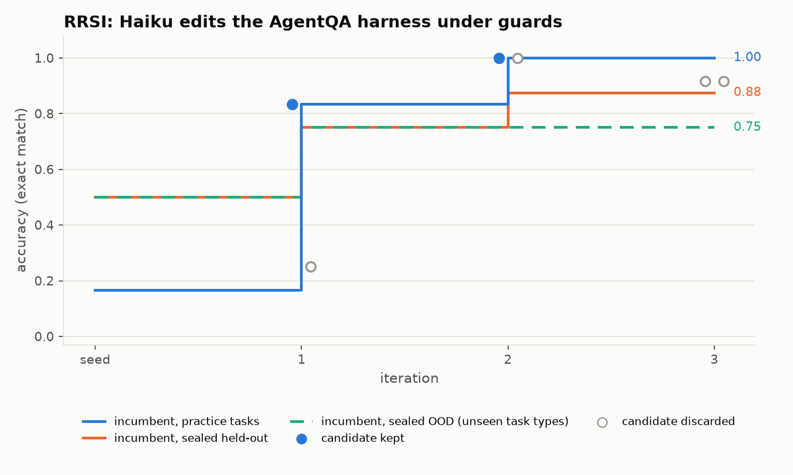
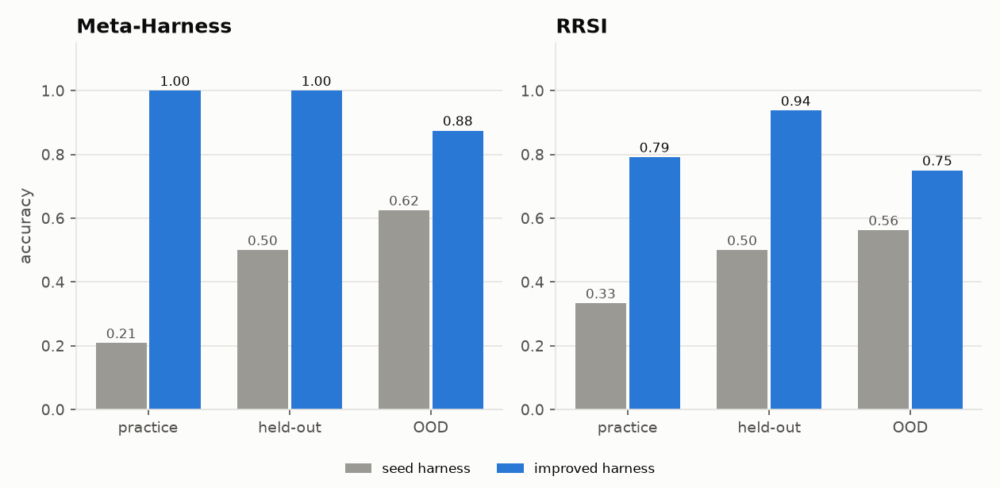
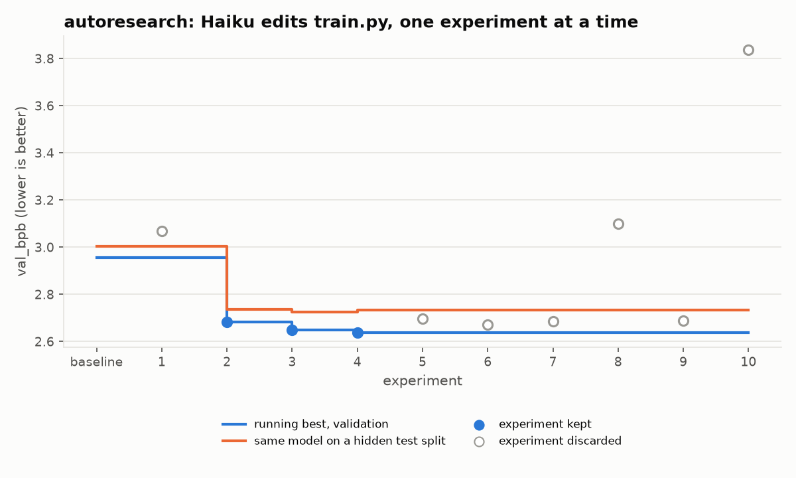
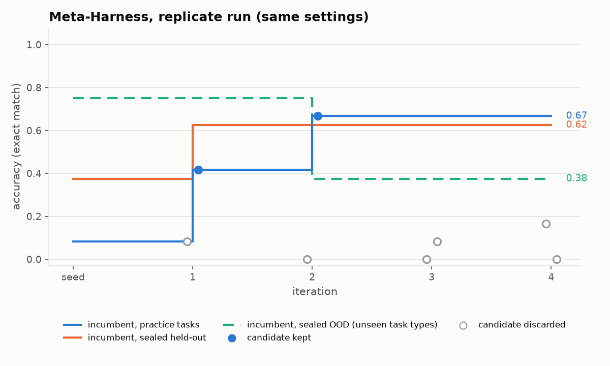

# Live demo: the package improving a real LLM agent

Four fresh runs on 30 Sep 2026. Each started from an untouched seed and used Claude Haiku both as the frozen task model and as the proposer. Every point on a chart is a real candidate that Haiku wrote and a locked grader scored. The held-out and OOD lines come from a write-only shadow monitor, so the loop never saw them.

Interactive version, with every candidate, the gate's verdict and the code produced: `demo/index.html`.

| Run | Method | Seed → final (practice / held-out / OOD) | Iterations | Spend |
|---|---|---|---:|---:|
| `runs/metaharness` | Meta-Harness | 0.21 → **1.00** / 0.50 → **1.00** / 0.62 → **0.88** (re-scored, k = 2) | 4 | $2.98 |
| `runs/metaharness_a` | Meta-Harness, replicate | 0.08 → 0.67 / 0.38 → 0.62 / 0.75 → **0.38** (in-loop, k = 1) | 4 | $2.70 |
| `runs/rrsi` | RRSI | 0.33 → **0.79** / 0.50 → **0.94** / 0.56 → **0.75** (re-scored, k = 2) | 3 | $2.42 (+$0.80 restarted attempt) |
| `runs/autoresearch` | autoresearch | val_bpb 2.956 → **2.637**, hidden test 3.004 → 2.734 (lower is better) | 10 | $0.70 |

Total live spend: $9.60.







## What happened

- **Meta-Harness.** The big step, at iteration 2, is a general strategy: the model writes Python, the harness runs it and reads the printed answer. From iteration 3 the kept harness also hard-codes regex templates for the task generator's question shapes. It was chosen because it scores the same with fewer tokens, and the general code path remains as a fallback. Its comments also quote six practice questions word for word, though no answers. Faithful Meta-Harness has no leakage guard, as in the paper. This is the brittle behaviour the claims audit recorded against the paper's "coherent algorithms" claim (Meta-Harness L4).
- **Meta-Harness replicate.** Same settings, different outcome. Practice and held-out rose, but OOD fell from 0.75 to 0.38. The sealed monitor exposed the overfit. This run was stopped by a background time limit during its final re-scoring, so it has no re-scored summary. A single live run is an anecdote.
- **RRSI.** Round 0 kept a general fix: parse Python from the reply, run it, and force a tool-grounded follow-up. The leakage critic rejected the first draft of both kept edits and passed them only after repair. The final harness contains no task answer, task id or question text (checked against all three splits). The run stopped at its $2.50 budget.
- **autoresearch.** Three kept changes: learning rate 0.003 → 0.01 → 0.02, then hidden width 128 → 256. The last keep improved validation by 0.011 but made the hidden test slightly worse (2.725 → 2.734). The strict keep rule locked in noise, as documented in the claims audit.

## Reproduce

```bash
python experiments/demo/live_demo.py metaharness     # or rrsi, autoresearch; refuses to overwrite a run
python experiments/demo/plot_demo.py                 # demo/data.json + demo/figures/*.png, straight from trace.jsonl
python experiments/demo/build_page.py                # demo/index.html
```

`demo/runs/<run>/TRACE.md` has every step: the proposer prompt and reply, the diff, the critic verdict, per-task scores and the gate arithmetic.

**Known issue.** A Meta-Harness run cannot replay from its LLM cache, because the proposer's history view includes a file's wall-clock `created_at` timestamp. Restarting the demo therefore produced a second, independent run (the replicate) instead of a $0 replay.
